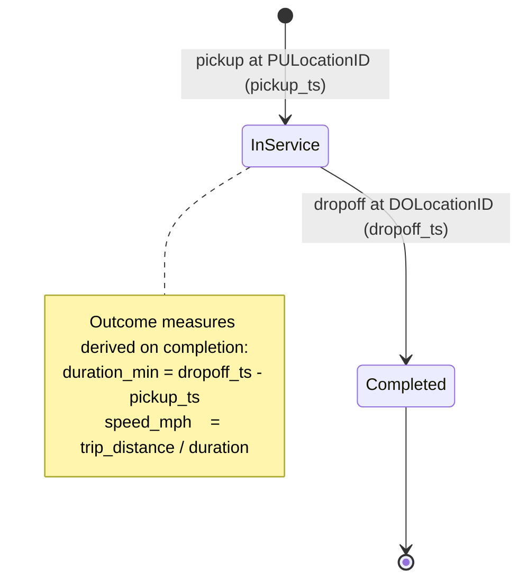
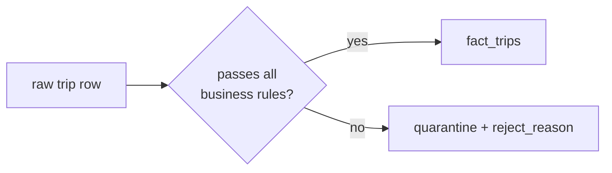
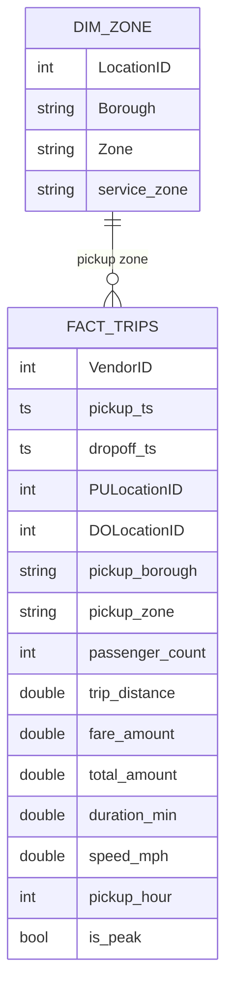

# Workflow & data model

## The trip as a workflow event (Class 7)

Each taxi trip is one business event with a simple lifecycle. Operations cares
about *where* and *when* it starts, and the *outcome* measures it produces.

A raw trip is only admitted to the model after it passes validation; otherwise
it is routed to quarantine with a reason (see the data-quality report).

## Relational model (star schema)

- **Grain of `fact_trips`:** one validated trip (event).
- **Join:** `fact_trips.PULocationID = dim_zone.LocationID` (pickup location),
  so demand and efficiency can be read by borough — the grain operations plan
  around.
- **Derived fields:** `duration_min`, `speed_mph`, `pickup_hour`, `is_peak`
  are computed once during validation/modelling and reused by all metrics.

## Metrics linked to the KPI

**KPI: Fleet efficiency & data trust.**

| Metric | Built from | Decision it supports |
|---|---|---|
| M1 Valid trip rate | validation summary | Is this month usable at all? |
| M2 Median trip duration | `fact_trips.duration_min` | Baseline trip length |
| M3 Median trip speed | `fact_trips.speed_mph` | Congestion / efficiency |
| M4 P90 trip duration | `fact_trips.duration_min` | Reliability tail |
| M5 Peak-hour trip share | `fact_trips.is_peak` | Staffing / supply timing |
